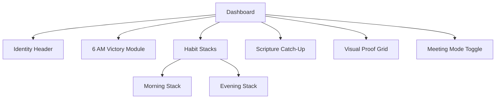

# Atomic Life - Architecture Plan

## 1. Project File Structure

```
atomic-life/
├── public/
│   ├── manifest.json              # PWA manifest
│   ├── icons/                     # App icons (192x192, 512x512)
│   └── sw.js                      # Service worker for PWA
├── src/
│   ├── app/
│   │   ├── layout.tsx             # Root layout with providers
│   │   ├── page.tsx               # Dashboard page
│   │   ├── globals.css            # Global styles (dark mode default)
│   │   └── api/                   # API routes (if needed)
│   ├── components/
│   │   ├── ui/                    # Reusable UI components
│   │   │   ├── Button.tsx
│   │   │   ├── Card.tsx
│   │   │   ├── Toggle.tsx
│   │   │   └── Modal.tsx
│   │   ├── IdentityHeader.tsx     # Dynamic greeting component
│   │   ├── SixAMVictory.tsx       # 6 AM Victory button module
│   │   ├── HabitStacks.tsx       # Morning & Evening checklists
│   │   ├── ScriptureCatchUp.tsx   # Scripture reading tracker
│   │   ├── MeetingModeToggle.tsx # Edge case toggle
│   │   └── VisualProofGrid.tsx    # GitHub-style contribution graph
│   ├── lib/
│   │   ├── supabase.ts            # Supabase client configuration
│   │   ├── time-utils.ts          # Time window logic
│   │   ├── habit-utils.ts         # Streak calculation logic
│   │   └── constants.ts          # App constants
│   ├── hooks/
│   │   ├── useAuth.ts             # Authentication hook
│   │   ├── useHabits.ts           # Habits data hook
│   │   └── useTime.ts             # Time-based logic hook
│   ├── types/
│   │   └── index.ts               # TypeScript type definitions
│   └── store/
│       └── index.ts               # State management (Zustand/Context)
├── .env.local                     # Environment variables
├── tailwind.config.ts             # Tailwind configuration
├── next.config.ts                 # Next.js configuration
└── package.json
```

## 2. Database Schema (Supabase)

### Tables

#### 1. `profiles` (Extends Supabase Auth)
```sql
CREATE TABLE profiles (
  id UUID PRIMARY KEY REFERENCES auth.users(id),
  email TEXT NOT NULL,
  display_name TEXT,
  target_identity TEXT DEFAULT 'Athlete',
  created_at TIMESTAMP WITH TIME ZONE DEFAULT NOW(),
  updated_at TIMESTAMP WITH TIME ZONE DEFAULT NOW()
);
```

#### 2. `habits`
```sql
CREATE TABLE habits (
  id UUID PRIMARY KEY DEFAULT gen_random_uuid(),
  user_id UUID NOT NULL REFERENCES profiles(id) ON DELETE CASCADE,
  name TEXT NOT NULL,
  description TEXT,
  habit_type TEXT NOT NULL CHECK (habit_type IN ('morning', 'evening', 'scripture')),
  stack_order INTEGER DEFAULT 0,
  is_active BOOLEAN DEFAULT true,
  created_at TIMESTAMP WITH TIME ZONE DEFAULT NOW()
);
```

#### 3. `habit_logs`
```sql
CREATE TABLE habit_logs (
  id UUID PRIMARY KEY DEFAULT gen_random_uuid(),
  user_id UUID NOT NULL REFERENCES profiles(id) ON DELETE CASCADE,
  habit_id UUID NOT NULL REFERENCES habits(id) ON DELETE CASCADE,
  date DATE NOT NULL,
  completed_at TIMESTAMP WITH TIME ZONE,
  notes TEXT,
  created_at TIMESTAMP WITH TIME ZONE DEFAULT NOW(),
  UNIQUE(user_id, habit_id, date)
);
```

#### 4. `daily_summaries`
```sql
CREATE TABLE daily_summaries (
  id UUID PRIMARY KEY DEFAULT gen_random_uuid(),
  user_id UUID NOT NULL REFERENCES profiles(id) ON DELETE CASCADE,
  date DATE NOT NULL,
  wake_up_completed BOOLEAN DEFAULT false,
  morning_stack_complete BOOLEAN DEFAULT false,
  evening_stack_complete BOOLEAN DEFAULT false,
  scripture_chapters_read INTEGER DEFAULT 0,
  meeting_mode BOOLEAN DEFAULT false,
  day_rating TEXT CHECK (day_rating IN ('perfect', 'partial', 'missed', 'meeting')),
  created_at TIMESTAMP WITH TIME ZONE DEFAULT NOW(),
  UNIQUE(user_id, date)
);
```

#### 5. `streaks`
```sql
CREATE TABLE streaks (
  id UUID PRIMARY KEY DEFAULT gen_random_uuid(),
  user_id UUID NOT NULL REFERENCES profiles(id) ON DELETE CASCADE,
  streak_type TEXT NOT NULL CHECK (streak_type IN ('overall', 'morning', 'evening', 'scripture')),
  current_count INTEGER DEFAULT 0,
  longest_count INTEGER DEFAULT 0,
  last_completed_date DATE,
  updated_at TIMESTAMP WITH TIME ZONE DEFAULT NOW(),
  UNIQUE(user_id, streak_type)
);
```

### Row Level Security (RLS)
```sql
ALTER TABLE profiles ENABLE ROW LEVEL SECURITY;
ALTER TABLE habits ENABLE ROW LEVEL SECURITY;
ALTER TABLE habit_logs ENABLE ROW LEVEL SECURITY;
ALTER TABLE daily_summaries ENABLE ROW LEVEL SECURITY;
ALTER TABLE streaks ENABLE ROW LEVEL SECURITY;

CREATE POLICY "Users can only view own data" ON profiles
  FOR ALL USING (auth.uid() = id);

CREATE POLICY "Users can only view own habits" ON habits
  FOR ALL USING (auth.uid() = user_id);

CREATE POLICY "Users can only view own logs" ON habit_logs
  FOR ALL USING (auth.uid() = user_id);

CREATE POLICY "Users can only view own summaries" ON daily_summaries
  FOR ALL USING (auth.uid() = user_id);

CREATE POLICY "Users can only view own streaks" ON streaks
  FOR ALL USING (auth.uid() = user_id);
```

## 3. Component Architecture

### Dashboard Page (`page.tsx`)


## 4. Business Logic

### Time Window Check Logic
```typescript
// src/lib/time-utils.ts

export const TIME_WINDOWS = {
  morning: { start: '05:45', end: '06:15', fallbackStart: '07:15', fallbackEnd: '07:45' },
  evening: { shutdown: '22:00' },
  greetings: [
    { start: '05:00', end: '08:00', identity: 'Athlete' },
    { start: '08:00', end: '18:00', identity: 'Engineer' },
    { start: '18:00', end: '22:00', identity: 'Scholar' },
    { start: '22:00', end: '23:59', identity: 'Recover' },
    { start: '00:00', end: '05:00', identity: 'Recover' }
  ]
};

export function isWithinTimeWindow(
  currentTime: Date, 
  useFallback: boolean = false
): { inWindow: boolean; state: 'active' | 'missed' | 'fallback' } {
  const hours = currentTime.getHours();
  const minutes = currentTime.getMinutes();
  const timeInMinutes = hours * 60 + minutes;
  
  const window = useFallback 
    ? { start: 435, end: 465 }  // 07:15 - 07:45
    : { start: 345, end: 375 }; // 05:45 - 06:15
  
  if (timeInMinutes >= window.start && timeInMinutes <= window.end) {
    return { inWindow: true, state: useFallback ? 'fallback' : 'active' };
  }
  return { inWindow: false, state: 'missed' };
}

export function getGreeting(currentTime: Date): string {
  const hours = currentTime.getHours();
  const greeting = TIME_WINDOWS.greetings.find(
    g => hours >= parseInt(g.start.split(':')[0]) && hours < parseInt(g.end.split(':')[0])
  );
  return `Good ${greeting?.start === '05:00' ? 'Morning' : ''}, ${greeting?.identity || 'Friend'}`;
}
```

### Streak Calculation Logic
```typescript
// src/lib/habit-utils.ts

export function calculateStreak(
  logs: { date: string; completed: boolean }[],
  requiredHabits: string[]
): number {
  let streak = 0;
  const sortedLogs = logs.sort((a, b) => new Date(b.date).getTime() - new Date(a.date).getTime());
  
  // Check last 30 days for streak calculation
  const recentLogs = sortedLogs.slice(0, 30);
  
  for (const log of recentLogs) {
    if (log.completed) {
      streak++;
    } else {
      // Allow 1 miss for meeting mode days
      if (!log.isMeetingMode) {
        break;
      }
    }
  }
  
  return streak;
}
```

## 5. State Management

Using React Context + localStorage for offline support:

```typescript
// src/store/index.ts
interface AppState {
  user: User | null;
  meetingMode: boolean;
  habits: Habit[];
  dailyLogs: Record<string, DailyLog>;
  currentStreak: number;
}
```

## 6. UI/UX Design System

### Tailwind Theme (Dark Mode Default)
```typescript
// tailwind.config.ts
export default {
  theme: {
    extend: {
      colors: {
        dark: {
          bg: '#0a0a0f',
          card: '#151520',
          border: '#252535'
        },
        accent: {
          success: '#10b981',  // Green for success
          warning: '#f59e0b',  // Amber for partial
          error: '#ef4444',    // Red for missed
          info: '#3b82f6'      // Blue for meeting mode
        }
      },
      animation: {
        'pulse-slow': 'pulse 3s cubic-bezier(0.4, 0, 0.6, 1) infinite',
        'glow': 'glow 2s ease-in-out infinite alternate'
      }
    }
  }
}
```

## 7. PWA Configuration

### manifest.json
```json
{
  "name": "Atomic Life",
  "short_name": "Atomic",
  "description": "Personal Habit Dashboard based on Atomic Habits",
  "start_url": "/",
  "display": "standalone",
  "background_color": "#0a0a0f",
  "theme_color": "#10b981",
  "icons": [
    { "src": "/icons/icon-192.png", "sizes": "192x192", "type": "image/png" },
    { "src": "/icons/icon-512.png", "sizes": "512x512", "type": "image/png" }
  ]
}
```

### Service Worker (sw.js)
```javascript
self.addEventListener('install', (event) => {
  event.waitUntil(
    caches.open('atomic-life-v1').then((cache) => {
      return cache.addAll(['/', '/manifest.json']);
    })
  );
});

self.addEventListener('fetch', (event) => {
  event.respondWith(
    caches.match(event.request).then((response) => {
      return response || fetch(event.request);
    })
  );
});
```

## 8. Deployment (Vercel)

### Environment Variables
```
NEXT_PUBLIC_SUPABASE_URL=your-project-url
NEXT_PUBLIC_SUPABASE_ANON_KEY=your-anon-key
```

### Vercel Config (vercel.json)
```json
{
  "buildCommand": "npm run build",
  "outputDirectory": ".next",
  "framework": "nextjs"
}
```

## 9. Implementation Order

1. **Week 1**: Project setup, database schema, authentication
2. **Week 2**: Core components (Header, 6 AM Victory, Habit Stacks)
3. **Week 3**: Business logic, Scripture Catch-Up, Visual Proof Grid
4. **Week 4**: PWA configuration, testing, deployment
